# Screenshot Program

## Admin
### Tampilan menu admin
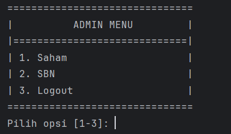

Di AdminMenu.show(), program menampilkan tiga opsi dan langsung membaca input dengan InputHelper.readInt("Pilih opsi [1-3]: ", 1, 3). Jika kita memasukkan angka di luar 1–3, helper otomatis menolak dan mencetak:

### 1 Tampilan menu saham Admin
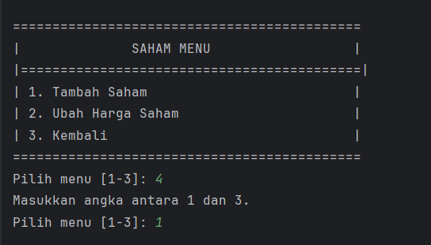

Pada Saham Menu, strukturnya serupa: tiga opsi dan validasi input dengan readInt("Pilih menu [1-3]: ", 1, 3). Pilihan “1” memanggil metode untuk menambah saham baru, “2” memanggil metode untuk memperbarui harga, dan “3” keluar kembali ke menu Admin.

### 1.1 Tampilan Tambah Saham Baru
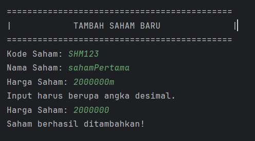

Dalam SahamService.addSaham(), program mencetak judul “TAMBAH SAHAM BARU” lalu meminta tiga input: kode dan nama saham lewat readString(), serta harga lewat readDouble(). Bila pengguna mengetikkan nilai non-numerik untuk harga, helper otomatis menolak dengan pesan “Input harus berupa angka desimal.” dan meminta ulang hingga benar. Setelah semua data valid terkumpul, objek Saham baru dibuat dan disimpan ke repositori, lalu ditutup dengan konfirmasi “Saham berhasil ditambahkan!”.

### 1.2 Tampilan ubah harga saham
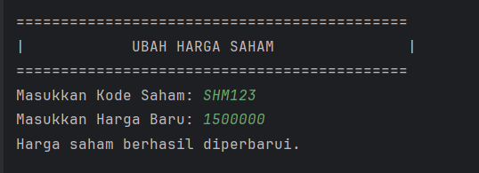

Jika findSahamByCode berhasil menemukan objek Saham, maka metode akan melakukan saham.setPrice(newPrice) dan menampilkan “Harga saham berhasil diperbarui.” sebelum kembali ke submenu.

### 1.2.1 scenario kode tidak di temukan saat merubah harga saham
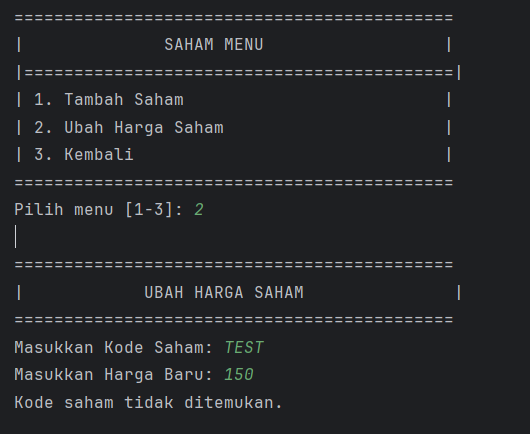

Ketika memilih opsi “2”, SahamService.updatePrice() akan menampilkan header “UBAH HARGA SAHAM” dan meminta kode saham serta harga baru. Program mencari saham dengan repo.findSahamByCode(code). Jika tidak ada, ia langsung mencetak “Kode saham tidak ditemukan.” dan kembali ke menu Saham.

## Customer
### Tampilan customer menu
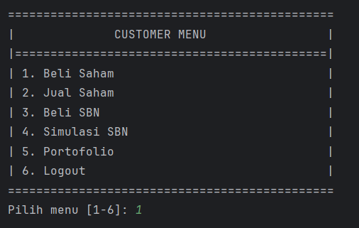

Di CustomerMenu.showMenu(), setiap input dibaca sebagai teks. Jika kita memasukkan karakter non‐angka atau angka di luar 1–6 (misal “1b” atau “7”), program langsung menampilkan:

“Pilihan tidak valid. Silakan pilih antara 1-6.”

lalu mengulang menu. Begitu kita memasukkan nilai 1–6, program langsung menjalankan aksi sesuai pilihan (misalnya “1” → buySaham()).

### 1 Tampilan Beli Saham
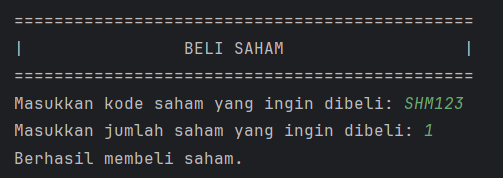

Saat opsi “1” dipilih pada customer menu, TransactionSaham.buySaham() menampilkan judul “BELI SAHAM” lalu meminta kode melalui readString dan kuantitas melalui readInt. Jika kode valid (ditemukan di ProdukRepository), kuantitas akan ditambahkan ke portofolio (portofolioService.addStockToPortfolio(...)) dan muncul konfirmasi “Berhasil membeli saham.”

### 1.1 jika kode tidak di temukan
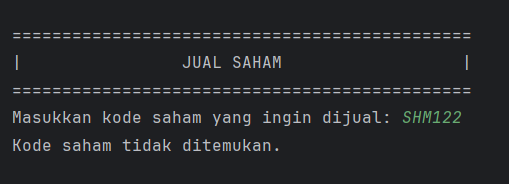

Dalam skenario ini, findSahamByCode("smm") menghasilkan Optional.empty(), sehingga program langsung menampilkan “Kode saham tidak ditemukan.” tanpa meminta jumlah dan kembali ke menu Customer.

### 2 Tampilan Jual Saham
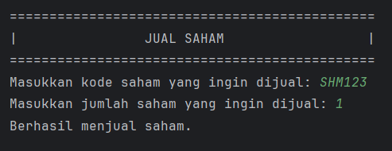

Memilih opsi 2 pada customer menu akan menjalankan `TransactionSaham.sellSaham()`. Program meminta kode saham dan jumlah yang ingin dijual. Jika kode ada dan jumlah saham mencukupi di portofolio, transaksi diproses dan tampil pesan “Berhasil menjual saham.” Jika tidak, muncul peringatan sesuai kondisi yang terjadi.

### 2.1 Jika Jumlah Saham Yang Dimiliki Kurang
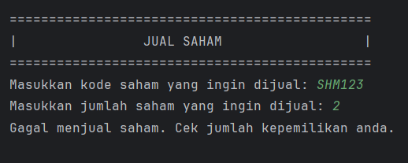

Jika portofolio hanya memiliki 1 lembar dan user ingin menjual 2, removeStockFromPortfolio mengembalikan false, lalu program menampilkan “Gagal menjual saham. Cek jumlah kepemilikan anda.” sebelum kembali ke menu.

### 2.2 Jika Tidak di Temukan Kode Saham

Apabila kode tidak ada di repositori, Optional.empty() diproses sehingga program langsung mencetak “Kode saham tidak ditemukan.” dan kembali ke menu Customer.

### 5 Tampilan Opsi Portofolio
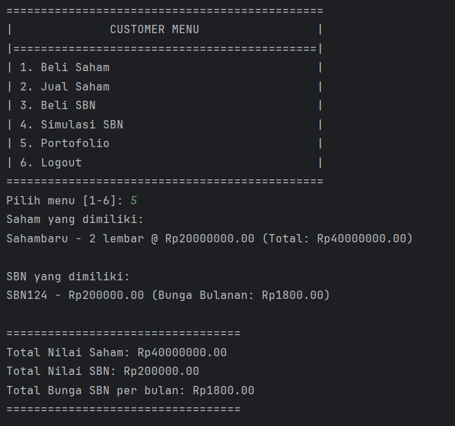

Saat kita memilih opsi 5, `CustomerMenu.showMenu()` memanggil `portfolioService.viewPortfolio()`, di mana program melakukan hal berikut secara otomatis: pertama ia menelusuri portofolio saham dengan mencetak setiap nama saham, jumlah lembar, harga per lembar, dan total nilai; kemudian menelusuri portofolio SBN dengan mencetak nama SBN, nominal yang dimiliki, serta perhitungan bunga bulanan; terakhir ia menjumlahkan dan menampilkan ringkasan — Total Nilai Saham, Total Nilai SBN, dan Total Bunga SBN per bulan — sehingga kita langsung melihat keseluruhan nilai investasi kita.