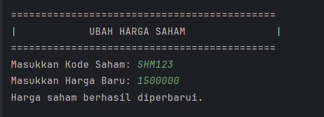

# Screenshot Program

### 2.Tampilan menu saham Admin

Pada Saham Menu, strukturnya serupa: tiga opsi dan validasi input dengan readInt("Pilih menu [1-3]: ", 1, 3). Pilihan “1” memanggil metode untuk menambah saham baru, “2” memanggil metode untuk memperbarui harga, dan “3” keluar kembali ke menu Admin.

### 2.1 Tampilan Tambah Saham Baru

Dalam SahamService.addSaham(), program mencetak judul “TAMBAH SAHAM BARU” lalu meminta tiga input: kode dan nama saham lewat readString(), serta harga lewat readDouble(). Bila pengguna mengetikkan nilai non-numerik untuk harga, helper otomatis menolak dengan pesan “Input harus berupa angka desimal.” dan meminta ulang hingga benar. Setelah semua data valid terkumpul, objek Saham baru dibuat dan disimpan ke repositori, lalu ditutup dengan konfirmasi “Saham berhasil ditambahkan!”.

### 2.2 Memilih opsi Ubah Harga saham pada menu saham dan tampilan ubah harga saham
### 2.2.1 scenario kode tidak di temukan saat merubah harga saham

Ketika memilih opsi “2”, SahamService.updatePrice() akan menampilkan header “UBAH HARGA SAHAM” dan meminta kode saham serta harga baru. Program mencari saham dengan repo.findSahamByCode(code). Jika tidak ada, ia langsung mencetak “Kode saham tidak ditemukan.” dan kembali ke menu Saham.

### 2.2.2  Scenario Jika kode saham di temukan

Jika findSahamByCode berhasil menemukan objek Saham, maka metode akan melakukan saham.setPrice(newPrice) dan menampilkan “Harga saham berhasil diperbarui.” sebelum kembali ke submenu.

